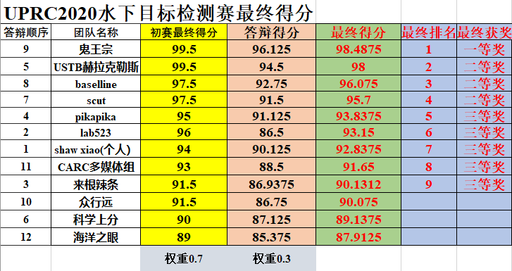

## URPC 2020 水下目标检测算法赛二等奖 

#### 队伍名：baseline

#### 整体方案：

1. Cascade RCNN 检测算法
2. 骨干网： resnetxt101_64d + DCN
3. SycBN
4. GC模块
5. Label smoothing
6. SoftNMS

#### 数据增强：

1. Mixup
2. Cutmix
3. RandomRotate90
4. Autoaugment

#### 部署方法：

1. 多尺度测试（no flip，翻转测试耗时）
2. Pytorch DDP

